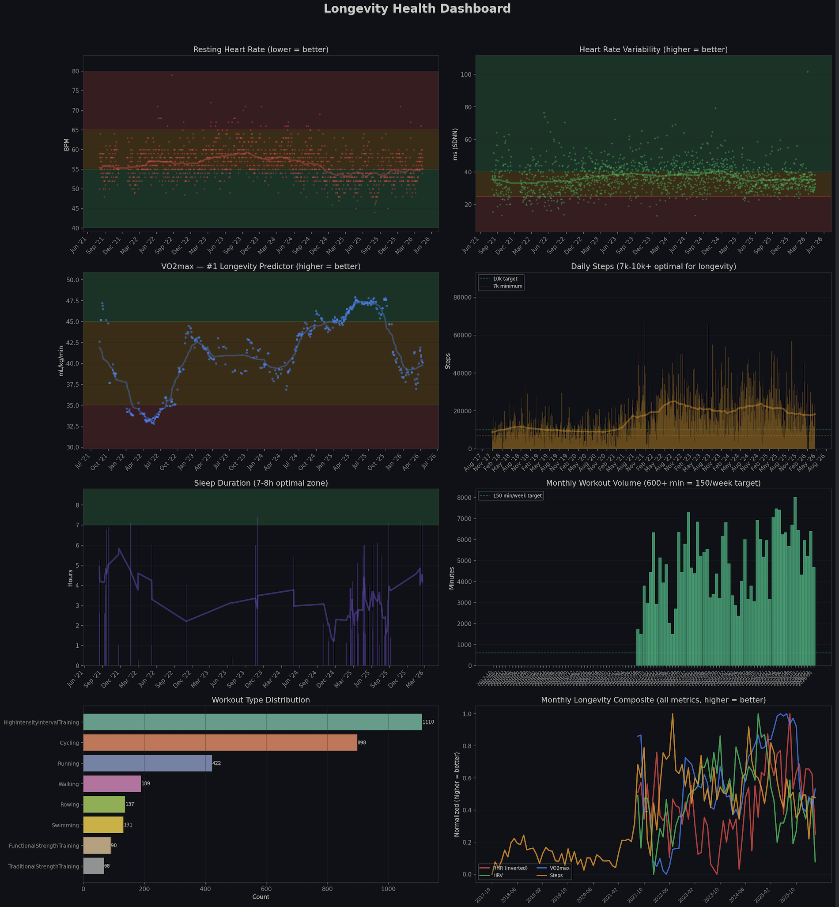
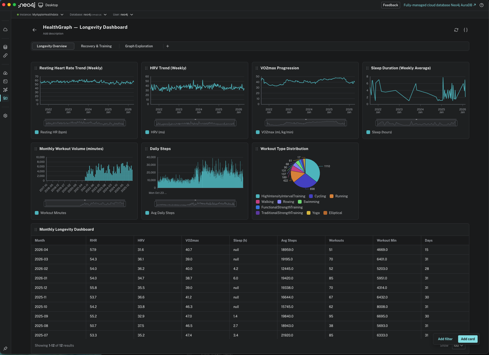

# Apple HealthGraph Agent

**[Neo4j Aura Agent Hackathon 2026](https://community.neo4j.com/t/start-here-register-get-aura-credits-aura-agent-hackathon-2026/77191) — Submission**

> _Your Apple Health data, finally connected. An AI agent that reasons over your health as a knowledge graph._

## The idea

Apple Health collects thousands of data points daily — heart rate, HRV, steps, sleep, workouts, respiratory rate, blood oxygen — but stores them as flat, disconnected time series. You can see _what_ happened, but never _why_ or _how things relate_.

**HealthGraph Agent** transforms your Apple Health XML export into a Neo4j knowledge graph that captures the relationships _between_ your health metrics, then deploys a Neo4j Aura Agent that can reason over those relationships to answer longevity questions like:

- "How does my sleep quality correlate with workout intensity?"
- "Show me weeks where my HRV was low — what happened before?"
- "What's my VO2max trend — am I improving my cardiorespiratory fitness?"
- "Am I overtraining? Show me training load vs recovery balance."
- "Find my best recovery days — what did I do differently?"

## Why a graph?

Health data is inherently relational. A flat table can show you your heart rate over time, but a graph can show you that _this specific workout_ on _this specific day_ preceded _this specific HRV drop_ during _this sleep session_, which correlated with _this elevated resting heart rate_ the next morning. The graph captures causality chains that tables cannot.

```
(:Person)-[:USES]->(:Device)-[:RECORDS]->(:MetricType)-[:HAS]->(:Measurement)
(:Measurement)-[:MEASURED_ON]->(:Day)-[:PART_OF]->(:Week)
(:Workout)-[:ON_DAY]->(:Day)<-[:ON_DAY]-(:SleepSession)
(:Day)-[:HAS_SUMMARY]->(:DailySummary {avg_hr, total_steps, hrv_mean, sleep_hours})
(:Workout)-[:FOLLOWED_BY]->(:SleepSession)
(:DailySummary)-[:CORRELATES_WITH]->(:DailySummary) // cross-metric correlations
```

---

## Two ways to import your data

### Method 1: Python ETL (recommended)

Direct Python pipeline that parses, transforms, and loads into Neo4j in one step. Works with both **Neo4j Desktop** and **Neo4j Aura**.

```bash
# Configure connection
cp .env.example .env
# Edit .env:
#   Desktop: NEO4J_URI=bolt://localhost:7687
#   Aura:    NEO4J_URI=neo4j+s://xxxxx.databases.neo4j.io

# Run with your own Apple Health data
bash scripts/run_pipeline.sh data/export.xml

# Or generate synthetic data and load
GENERATE=1 PERSONA=biohacker bash scripts/run_pipeline.sh
```

### Method 2: CSV + LOAD CSV (no Python needed at runtime)

Export data to CSV files, then import via pure Cypher in Neo4j Browser. Ideal for users who prefer working directly in the Neo4j Browser UI.

```bash
# Step 1: Export to CSV (one-time Python step)
METHOD=csv bash scripts/run_pipeline.sh data/export.xml

# Step 2: Copy CSVs into Neo4j Desktop import/ directory
#   Neo4j Desktop → Database → ... → Open folder → Import
#   Copy all files from data/csv/ into that folder

# Step 3: Open Neo4j Browser and run cypher/load_csv_import.cypher
#   Paste each block one at a time
```

**For Aura**: Upload CSVs to a public URL, then replace `file:///` with your URL prefix in `load_csv_import.cypher`.

---

## Synthetic test data

Don't have Apple Health data? Generate realistic 12-month synthetic datasets:

```bash
cd etl
python generate_test_data.py --persona athlete --days 365 --output ../data/export.xml
```

| Persona      | RHR  | HRV  | Steps/day | Sleep | VO2Max | Workouts/week |
|-------------|------|------|-----------|-------|--------|---------------|
| `default`   | 64   | 42ms | 8,000     | 7.2h  | 38     | 3.8           |
| `athlete`   | 52   | 65ms | 12,000    | 7.8h  | 48     | 5.6           |
| `sedentary` | 74   | 28ms | 4,500     | 6.5h  | 30     | 1.4           |
| `biohacker` | 58   | 55ms | 10,000    | 7.5h  | 42     | 4.6           |

---

## 20 Longevity Cypher queries

The file `cypher/longevity_queries.cypher` contains 20 ready-to-run queries focused on longevity science biomarkers:

| #  | Query                                | Longevity relevance                                      |
|----|--------------------------------------|----------------------------------------------------------|
| 1  | VO2max trend over time               | Strongest predictor of all-cause mortality                |
| 2  | Monthly VO2max with exercise context | Zone 2 and HIIT drive VO2max improvement                 |
| 3  | Resting heart rate trend             | RHR > 75 doubles mortality risk vs < 55                  |
| 4  | HRV weekly trend                     | Autonomic resilience declines with age                    |
| 5  | Sleep duration distribution          | U-shaped mortality curve; 7-8h optimal                   |
| 6  | Exercise variety and consistency     | Cardio + strength = 40% lower mortality vs either alone   |
| 7  | Zone 2 proxy (walks + easy cardio)   | Foundation of longevity exercise: 150+ min/week           |
| 8  | Recovery quality after hard training | Where adaptation happens                                  |
| 9  | Strength training frequency          | Prevents sarcopenia, preserves bone density               |
| 10 | Cardio training volume               | 150 min/week minimum; 300+ for extra benefit              |
| 11 | Sleep consistency                    | Irregular sleep is an independent mortality risk          |
| 12 | Compound longevity score per day     | Multi-marker "green days" assessment                      |
| 13 | Daily steps (NEAT)                   | 7,000-10,000 steps reduces mortality 50-70%               |
| 14 | Blood oxygen trends                  | Catches respiratory/cardiovascular decline early          |
| 15 | Workout impact on next-day HRV       | Training adaptation signal                                |
| 16 | Training load vs recovery balance    | Overtraining detection                                    |
| 17 | Rest day quality                     | Active recovery effectiveness                             |
| 18 | Weekly energy balance                | Metabolic health proxy                                    |
| 19 | Month-over-month longevity dashboard | High-level trend across all key biomarkers                |
| 20 | Personal bests and milestones        | Progress tracking across HRV, RHR, VO2max, steps, sleep  |

---

## Architecture

```
┌─────────────┐     ┌──────────────┐     ┌─────────────────────────┐     ┌─────────────┐
│ Apple Health │────>│  Python ETL  │────>│  Neo4j Desktop / Aura   │────>│ Aura Agent  │
│  export.xml  │     │  parse/load  │     │                         │     │  MCP + REST │
└─────────────┘     └──────┬───────┘     └─────────────────────────┘     └─────────────┘
                           │                        ▲
                           │  CSV export            │ LOAD CSV
                           └──> data/csv/ ──────────┘
```

### Graph model

| Node            | Properties                                        | Source                          |
|-----------------|---------------------------------------------------|---------------------------------|
| `Person`        | `name`                                            | export.xml `<Me>` tag           |
| `Device`        | `name`, `manufacturer`, `model`, `sw_version`     | `sourceName`, `device` attrs    |
| `MetricType`    | `identifier`, `display_name`, `unit`, `category`  | `type` attr (cleaned)           |
| `Workout`       | `activity_type`, `duration`, `energy_burned`, `distance` | `<Workout>` elements     |
| `SleepSession`  | `in_bed_start`, `in_bed_end`, `asleep_duration`   | SleepAnalysis records           |
| `Day`           | `date`, `day_of_week`                             | Derived from timestamps         |
| `Week`          | `year`, `week_number`, `start_date`               | Derived from timestamps         |
| `DailySummary`  | `avg_hr`, `hrv_mean`, `total_steps`, `active_cal`, `sleep_hours` | Aggregated     |

| Relationship         | From → To                       | Properties              |
|----------------------|---------------------------------|-------------------------|
| `USES`               | Person → Device                 |                         |
| `RECORDS`            | Device → MetricType             |                         |
| `HAS`                | MetricType → Measurement        |                         |
| `MEASURED_ON`        | Measurement → Day               |                         |
| `ON_DAY`             | Workout / SleepSession → Day    |                         |
| `PART_OF`            | Day → Week                      |                         |
| `HAS_SUMMARY`        | Day → DailySummary              |                         |
| `FOLLOWED_BY`        | Workout → SleepSession          | `hours_between`         |
| `NEXT_DAY`           | Day → Day                       |                         |
| `CORRELATES_WITH`    | DailySummary → DailySummary     | `correlation_score`     |

### Aura Agent tools

| Tool              | Type            | Purpose                                            |
|-------------------|-----------------|-----------------------------------------------------|
| Weekly overview   | Cypher Template | "Show me last week's health summary"                |
| Workout impact    | Cypher Template | "How did my workout affect my sleep/HRV?"           |
| Trend finder      | Text2Cypher     | Free-form questions about health patterns           |
| Pattern match     | Similarity Search | Find similar days/weeks by health metric embeddings |

---

## Longevity Dashboard

Two visualization options for exploring your health data:

### Python Charts

```bash
# Generate all charts (full history)
python3 scripts/visualize_longevity.py

# Last 6 months only
python3 scripts/visualize_longevity.py --months 6
```

Generates an 8-panel dashboard and individual high-res charts with longevity zone coloring:

| Chart | What it shows |
|-------|--------------|
| Resting Heart Rate | Trend with zones: green (< 55), yellow (55-65), red (> 65 bpm) |
| HRV (SDNN) | Autonomic resilience: green (> 40ms), yellow (25-40), red (< 25) |
| VO2max | #1 longevity predictor: green (> 45), yellow (35-45), red (< 35) |
| Daily Steps | Bar chart with 7k minimum and 10k target lines |
| Sleep Duration | Green optimal zone at 7-9 hours |
| Workout Volume | Monthly minutes, green when exceeding 150 min/week target |
| Workout Types | Distribution of activity types |
| Composite Trend | All metrics normalized, higher = better |



See [docs/DASHBOARD.md](docs/DASHBOARD.md) for detailed documentation and longevity science behind each metric.

### Health Analysis Report

Beyond charts, generate a personalized analysis with actionable advice:

```bash
python3 scripts/analyze_longevity.py
```

See the latest report: **[Longevity Health Analysis Report](docs/HEALTH_REPORT.md)** — includes trend analysis, exercise balance, overtraining detection, workout-HRV impact ranking, and specific action items.

For a deep-dive on **exercise-duration data quality** (runaway watch sessions, cross-app double tracking, and the cleaning rules used to produce credible weekly totals) see **[Exercise Duration Report](docs/EXERCISE_REPORT.md)** and the corresponding Cypher in [`cypher/exercise_duration_clean.cypher`](cypher/exercise_duration_clean.cypher). The NeoDash dashboard now includes a dedicated **Exercise Duration (Cleaned)** page with weekly/monthly/yearly cleaned trends and a raw-vs-cleaned audit.

### NeoDash Interactive Dashboard

For interactive, browser-based charts directly from Neo4j:

1. Install **NeoDash** from Neo4j Desktop plugin gallery
2. Import `neodash/longevity_dashboard.json`
3. Explore 3 pages: Longevity Overview, Recovery & Training, Graph Exploration



---

## Repo structure

```
healthgraph-agent/
├── README.md
├── .gitignore
├── .env.example                     # Connection config for Desktop + Aura
│
├── docs/
│   ├── export_instructions.md       # How to export from iPhone
│   └── DASHBOARD.md                 # Dashboard documentation + longevity science
│
├── etl/
│   ├── requirements.txt             # lxml, neo4j, python-dotenv, tqdm
│   ├── parse_health_xml.py          # Streaming XML parser (handles 2GB+)
│   ├── transform.py                 # Aggregate daily summaries, build relationships
│   ├── load_to_neo4j.py             # Method 1: Direct batch load via Bolt driver
│   ├── export_to_csv.py             # Method 2: Export to CSV for LOAD CSV import
│   └── generate_test_data.py        # Synthetic data generator (4 personas)
│
├── cypher/
│   ├── sample_queries.cypher        # 7 general-purpose Aura Agent templates
│   ├── longevity_queries.cypher     # 20 longevity-focused analysis queries
│   └── load_csv_import.cypher       # Method 2: LOAD CSV import script
│
├── scripts/
│   ├── run_pipeline.sh              # End-to-end orchestration (both methods)
│   └── visualize_longevity.py       # Python chart generator (8 panels + individual)
│
├── neodash/
│   └── longevity_dashboard.json     # Interactive NeoDash dashboard (3 pages)
│
└── agent/
    └── agent_config.md              # Aura Agent system prompt + tool definitions
```
---

## Getting started

### Prerequisites

- Python 3.11+
- Neo4j Desktop (free) OR Neo4j Aura account (free tier available)

### Quick start

```bash
# 1. Clone
git clone https://github.com/ma3u/healthgraph-agent.git
cd healthgraph-agent

# 2. Install dependencies
pip install -r etl/requirements.txt

# 3. Get your health data (pick one):

#    A) Export from iPhone:
#       Health → Profile → Export All Health Data
#       Unzip and place export.xml in data/

#    B) Generate synthetic data:
GENERATE=1 bash scripts/run_pipeline.sh

# 4. Configure Neo4j connection
cp .env.example .env
# Edit .env with your Neo4j URI and password

# 5. Import (pick a method):

#    Method 1 — Python ETL (direct load):
bash scripts/run_pipeline.sh

#    Method 2 — CSV + LOAD CSV:
METHOD=csv bash scripts/run_pipeline.sh
#    Then run cypher/load_csv_import.cypher in Neo4j Browser

# 6. Run longevity queries
#    Open cypher/longevity_queries.cypher in Neo4j Browser
```

---

## Key health metrics

### From Apple Watch
- Heart rate (resting, walking, workout)
- Heart rate variability (SDNN)
- Blood oxygen (SpO2)
- Respiratory rate
- Active/basal energy burned
- Stand hours, exercise minutes

### From iPhone
- Step count
- Walking + running distance
- Flights climbed

### Derived (computed in ETL)
- Daily longevity score (composite of HRV, RHR, sleep, steps, exercise)
- Recovery patterns (workout → sleep → next-day HRV chains)
- Training load balance (volume vs recovery markers)
- Sleep consistency (standard deviation across weeks)

---

## Privacy & data handling

- **All data stays local** during ETL — no third-party APIs for parsing
- Apple Health export contains PII — `.gitignore` excludes all XML/CSV data files
- Neo4j connection via encrypted Bolt protocol (Aura) or local-only (Desktop)
- No health data committed to the repository — only code and schema

---

## Tech stack

| Component    | Technology                     | License     |
|-------------|-------------------------------|-------------|
| ETL         | Python 3.11+, lxml, neo4j-driver | Apache 2.0 |
| Database    | Neo4j Desktop or AuraDB       | Commercial  |
| Agent       | Neo4j Aura Agent (Gemini 2.5 Flash) | Commercial |
| Embeddings  | Vertex AI `gemini-embedding-001` | Commercial |

---

## Next steps

See [Issue #1: Deploy to Neo4j Aura and configure Aura Agent](https://github.com/ma3u/healthgraph-agent/issues/1) for the detailed roadmap.

## Hackathon checklist

- [x] Complete [Building Agents in Neo4j Aura Course](https://dev.neo4j.com/aura-agent-hackathon-community) (by May 15)
- [x] Register for [$100 Aura Credits](https://dev.neo4j.com/credit-claim-aura-agent-hackathon-2026)
- [x] Build ETL pipeline (Method 1: Python, Method 2: CSV)
- [x] Synthetic test data generator (4 personas)
- [x] 20 longevity-focused Cypher queries
- [x] Load health data into Neo4j Desktop (3,087 days, 3,180 workouts)
- [x] Longevity dashboard (Python charts + NeoDash)
- [ ] Create AuraDB instance and load data ([#1](https://github.com/ma3u/healthgraph-agent/issues/1))
- [ ] Configure Aura Agent with tools ([#1](https://github.com/ma3u/healthgraph-agent/issues/1))
- [ ] Generate vector embeddings for similarity search ([#1](https://github.com/ma3u/healthgraph-agent/issues/1))
- [ ] Test agent with longevity questions ([#1](https://github.com/ma3u/healthgraph-agent/issues/1))
- [ ] Take screenshots (console + agent demo)
- [x] Submit to [community thread](https://community.neo4j.com/t/start-here-register-get-aura-credits-aura-agent-hackathon-2026/77191)

