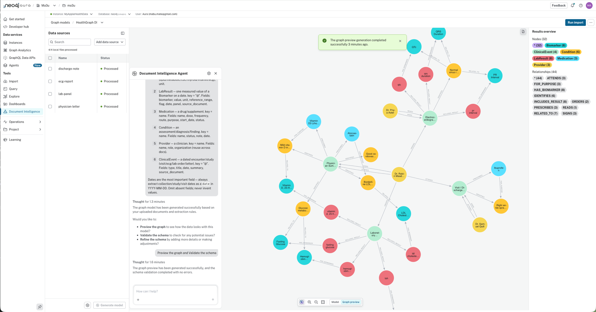

# Document Intelligence Pilot Kit

A self-contained kit for evaluating **Neo4j Aura Document Intelligence (DI)** against
the Apple HealthGraph project: ingesting the clinical documents the structured Apple
Health ETL ignores today (`export_cda.xml`, `electrocardiograms/`, `clinical-records/`)
into the existing health graph, and linking the extracted clinical entities onto the
day-by-day `(:Day)` timeline so the Aura Agent can answer hybrid questions the
structured-only graph cannot.

**Tracking issue:** [#10 — Evaluate Aura Document Intelligence for Apple HealthGraph and
clarify API/CLI availability](https://github.com/ma3u/healthgraph-agent/issues/10)

---

## Pilot status (2026-06-21)

First run executed in the Aura Console against the 4 synthetic docs (instance
`MyAppleHealthData`):

- [x] Instance connected; 4 docs uploaded → **Processed** (4/4)
- [x] Graph model **"HealthGraph DI"** generated — 6 labels (`Biomarker`, `LabResult`,
      `Medication`, `Condition`, `Provider`, `ClinicalEvent`) with relationships
      (`HAS_BIOMARKER`, `INCLUDES_RESULT`, `PRESCRIBES`, `IDENTIFIES`, `ORDERS`,
      `SIGNS`/`READS`/`ATTENDS`, `RELATED_TO`, `FOR_PURPOSE`)
- [x] **Run import** — clinical entities extracted into the graph (preview below)
- [ ] Post-import: `link_clinical_to_days.cypher` → `validate_clinical.cypher`
- [ ] Aura Agent hybrid question (clinical × `DailySummary`)

> The model was generated from the four documents in ~1 minute with no extraction code —
> a first step toward a private, graph-native electronic health record that aggregates
> every silo onto the same `(:Day)` timeline.

---

> ## Preview / console-only — no real data
>
> - **Document Intelligence is in PREVIEW** and documented by Neo4j as AS-IS, for
>   internal/development use — not production-critical workflows. Treat any generated
>   model as a draft you must review and correct.
> - **DI is console/UI-only today.** There is no DI API, CLI command group, or MCP
>   server yet (Neo4j places those on the roadmap), so this pilot is run **manually**
>   from the Aura Console and **cannot be scripted** into the repo pipeline yet.
> - **No real personal data, ever.** This kit uses only the obviously **SYNTHETIC**
>   documents in [`sample-docs/`](sample-docs/) (fictional patient "Alex Sample",
>   fictional "Northwind Health"). Per this repo's no-personal-data policy, never upload
>   a real Apple Health export, real lab/ECG/provider records, or anything personal to
>   DI, and never commit such data to this repo.

---

## How to start

**Read [`PILOT.md`](PILOT.md) first** — it is the step-by-step runbook (prerequisites →
upload the 4 synthetic docs → paste focus instructions → review the model → run import →
link to days → validate → ask the Aura Agent a hybrid question). Everything else in this
folder is referenced from there.

## What's in the kit

| File | Purpose |
|---|---|
| [`PILOT.md`](PILOT.md) | **Start here.** End-to-end runbook for the console-driven pilot. |
| [`MODEL.md`](MODEL.md) | Graph-model spec: the six target domain labels, dedup-`key` design, field mapping from the sample docs, provenance layer, and the **focus instructions to paste into DI**. |
| [`link_clinical_to_days.cypher`](link_clinical_to_days.cypher) | Post-import Cypher that attaches each dated clinical entity to the existing `(:Day {date})` via `[:ON_DAY]`. Non-destructive and idempotent. |
| [`validate_clinical.cypher`](validate_clinical.cypher) | Read-only post-import checks: provenance counts, per-domain label counts, day-link coverage, a provenance traversal, and the hybrid clinical-plus-`DailySummary` query. |
| [`sample-docs/lab-panel.md`](sample-docs/lab-panel.md) | Synthetic lipid / metabolic / CBC / thyroid / vitamin panel (collected 2026-03-12). |
| [`sample-docs/physician-letter.md`](sample-docs/physician-letter.md) | Synthetic physician summary letter with a medications table (visit 2026-03-18). |
| [`sample-docs/ecg-report.md`](sample-docs/ecg-report.md) | Synthetic 12-lead resting ECG report (study 2026-04-02). |
| [`sample-docs/discharge-note.md`](sample-docs/discharge-note.md) | Synthetic urgent-care visit / discharge note (encounter 2026-05-09). |

## Target domain model (summary)

DI extracts six domain labels — **`Biomarker`, `LabResult`, `Condition`, `Medication`,
`Provider`, `ClinicalEvent`** — each also carrying DI's `__Entity__` label plus a `key`
for deduplication. DI's provenance layer (`__Document__`, `__Chunk__`, and their
relationships) keeps every clinical fact one hop from the exact source document and
chunk it was read from. See [`MODEL.md`](MODEL.md) for the full schema and rationale.

## Prerequisites (recap — see PILOT.md for detail)

- Your **own** AuraDB instance with the structured health graph already loaded
  (`(:Day)`, `(:DailySummary)`, `(:Workout)`, `(:SleepSession)`). Per the BYO-Aura
  policy, the dev instance is dev-only and never a default.
- A DI-supported tier (AuraDB Free, Professional, or Business Critical). On
  Professional / Business Critical, enable "Tool authentication with Aura user" first.
- The 4 synthetic docs from [`sample-docs/`](sample-docs/) downloaded locally.
